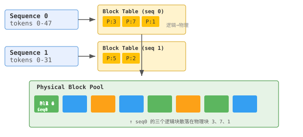
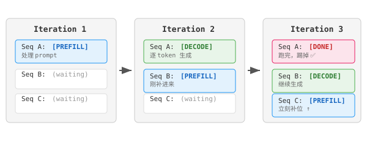

# Mini LLM Serving Engine

前段时间看了两篇 LLM serving 的论文——vLLM和 Orca，主要就是 kv cache 和 Continuous Batching ，尝试自己写一遍。
用 mock attention 假装在算，验证这俩做法对吞吐和延迟到底能差多少。

## 背景——LLM serving 为什么是个难题

LLM 推理跟传统 web 服务不一样的地方在于，每个请求要占大量 GPU 显存，而且是持续占着——
生成一个 token 就多存一点 KV cache，整个生成过程中这些数据都不能丢。

显存里两个大头: 模型权重 + KV cache。权重是死的，加载完就不变了；KV cache 是动态的，
每个请求进来就长，请求走了才回收。所以怎么管 KV cache 直接决定了能同时服务多少个用户。

传统做法特别粗暴——给每个请求预分配一整块连续显存，size = max_seq_len × num_layers ×
2(K+V) × num_heads × head_dim × sizeof(fp16)。max_seq_len 设 2048 的话，一个请求光
KV cache 就得占 1GB+。但大部分用户发一句话才几十个 token，这 1GB 里 90% 以上是空着的。
而且每块是连续的，释放之后留下的坑不一定有人能填——碎片化。

## Paged KV Cache —— 跟 OS 学的

vLLM 这篇论文的思路说起来特别简单: 把 KV cache 切成固定大小的 block（页），每个序列
不直接拿物理块，而是通过一张 block table（页表）做翻译。跟操作系统虚拟内存完全一个思路。



序列 0 的逻辑块 0/1/2 映射到物理块 3/7/1——物理上是不连续的，但逻辑上通过 block table
拼起来就是一段连续的 KV cache。attenton 的时候，kernel 遍历 block table 拿到物理块号，
再去对应的位置读 K/V。多了一次查表，但多出来的开销相比省下的显存完全可以接受。

这么做几个直接的好处:
- 按需分配——短 prompt 就少拿几个 block，不用预留 max_len
- 零内部碎片——block 固定大小，最小分配单位就是一个 block，不存在"剩 3 个 token 放不下"的情况
- CoW——beam search 的时候多个候选共享前缀 block，真要写入了才 fork

| | 传统预分配 | Paged KV Cache |
|---|---|---|
| 内存利用率 | ~50%（按 max_len 预留） | ~95%（用多少拿多少） |
| 内存碎片 | 严重 | 几乎没有 |
| Beam search | 每条候选完整复制 | CoW 共享前缀，写入时才分叉 |
| 动态扩展 | 得找新的连续空间 | 追加新 block 就行 |

一个 block 多大合适？太小 → block table 开销大（得查更多次表）；太大 → 碎片多。
vLLM 论文里试了 8/16/32/64，结论是 16 tokens/block 最平衡。按 Llama-7B 的参数算:
16 × 32 layers × 2(K+V) × 32 heads × 128 dims × 2 bytes(fp16) ≈ 8 MB per block。
1024 个 block ≈ 8 GB，加模型权重 14 GB，差不多一张 A10。

## Continuous Batching —— 每跑完一轮就重新组队

传统 static batching 是固定 batch_size=8，8 个请求一起 prefill，然后同步 decode，
等最慢的那个跑完，整批退出。问题是——有短的早跑完了，slot 空着在等最长的那位，
GPU 在那干烧电。

Orca 论文说: 别等了。每个 iteration 结束就重新调度一次。跑完的立刻滚，排队的马上补。
GPU 闲不下来。



我们这个 demo 里的调度逻辑:
1. Prefill 优先——新请求尽快开始 prefill，降首 token 延迟（TTFT）
2. 内存感知——看 free block 的数量决定能不能放新请求进来（prefill 要一次分好几个 block）
3. Preemption——实在没内存了，踢掉最晚来的 decode 请求（recompute 策略: 释放 KV cache +
   塞回队列头部，下次从头 prefill）。recompute 的原因是 decode 本身是 memory-bound，
   重算的代价相对小，但 OOM 直接崩了可不行

## Prefill vs Decode —— 瓶颈完全不一样，调度才有优化空间

如果 prefill 和 decode 的耗时模型一样，那怎么调度区别不大。但实际情况:

| 阶段 | 干什么 | 瓶颈 | 性质 |
|------|--------|------|------|
| Prefill | 一次性处理整个 prompt 的 self-attention，大矩阵乘法 | GPU 算力 | Compute-bound |
| Decode | 每次生成 1 个 token，从显存读整个历史 K/V | 显存带宽 | Memory-bound |

Prefill 是 O(prompt_len²) 的矩阵运算——flops 密集，GPU 吃得满。
Decode 是每步算一个新的 q，但从 HBM 往外捞整个 context 的 K-cache/V-cache——
捞半天数据算几口就完了，时间全耗在等显存上。

这也是为什么 continuous batching 有用: decode 阶段 batch 越大，同一次 kernel launch
可以摊分 KV cache 的读取开销（读一次给 batch 里所有请求用）。

mock_attention.h 里模拟了这个:
- Prefill 耗时 = k × prompt_len² + noise
- Decode 耗时 = k × context_len / sqrt(batch_size) + noise
  用 sqrt 是因为 batch 越大带宽利用率越高但收益递减——不是一个线性关系。

## 代码怎么组织的

```
mini-llm-serve/
├── CMakeLists.txt
├── README.md                   ← 你正在看的
├── include/
│   ├── block.h                 # 物理块、block table entry、Config 常量
│   ├── kv_cache_manager.h      # KV cache 的分页管理（分配/释放/CoW/Fork）
│   ├── request.h               # 请求的状态机 + TTFT/TPOT 指标
│   ├── scheduler.h             # Continuous Batching 调度
│   ├── mock_attention.h        # 模拟 prefill/decode 耗时
│   └── engine.h                # 主循环，把上面串起来跑
├── src/
│   └── main.cpp                # benchmark + Static vs Continuous 对比实验
├── test/
│   ├── test_kv_cache.cpp       # KV cache 单元测试
│   ├── test_scheduler.cpp      # 调度器集成测试
│   ├── paged_attention_walkthrough.cpp  # CPU 版 PagedAttention（可以单文件 g++ 跑）
│   └── store_kv_attention_flow.txt      # 一层 transformer 里的执行顺序
```

## 编译

```bash
cmake -B build -G Ninja && ninja -C build

./build/test_kv_cache         # 测 KV cache 分配/释放/CoW
./build/test_scheduler        # 测调度逻辑
./build/mini-llm-serve 50 64  # benchmark: 50 请求 × 最多 64 tokens
```

## 结果

```
=== Mini LLM Serving Engine ===
模拟 30 个并发请求, 每个最多生成 32 tokens
KV Cache: 1024 blocks × 16 tokens/block = 16384 token 容量

========== Benchmark Results ==========
吞吐:
  Total Time:       126.0 ms
  Throughput:       7620.1 tokens/sec

延迟 (已完成 30 请求):
  Avg TTFT:         3.21 ms     ← 用户等第一个字的平均时间
  Avg TPOT:         3.78 ms     ← decode 阶段每个 token 的生成间隔

>>>>>>>>>> 对比: Static Batching vs Continuous Batching <<<<<<<<<<

[Continuous Batching]  Throughput: 7618.6 tokens/sec
[Static Batching]     Throughput: 6225.2 tokens/sec   ← 差了 ~22%
```

22% 的差距来自三件事:
1. Continuous 下短请求跑完立刻腾位置，新请求上来——GPU 不等
2. 不用等 batch 里最慢的那个跑完——没有 padding
3. KV cache 按需分配，更多人能同时跑，而不是排队等显存

## 读了这些论文

- [vLLM: Efficient Memory Management for LLM Serving with PagedAttention](https://arxiv.org/abs/2309.06180) — SOSP 2023
- [Orca: A Distributed Serving System for Transformer-Based Generative Models](https://www.usenix.org/conference/osdi22/presentation/yu) — OSDI 2022
- [Splitwise: Efficient Generative LLM Inference Using Phase Splitting](https://arxiv.org/abs/2311.18677) — ISCA 2024, prefill/decode 分开部署的进一步讨论
